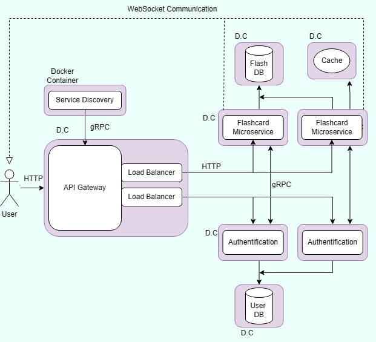

# Online Study Platform

## Project Description

The platform is an online study tool that enables users to securely create, edit, share flashcards and has authentication services.

## Application Suitability Assessment

### Why Microservices are Relevant for the Study Platform:

- **Complexity and Independent Components**: Managing flashcards as a separate microservice simplifies scaling, maintenance, and upgrades, ensuring better performance and flexibility.

- **Scalability**: The Flashcards Microservice scales independently to handle high usage during peak times like exams.

- **Real-time Updates**: WebSockets enable real-time notifications for flashcard updates and changes.

- **Faster Iteration**: Decoupling flashcards allows faster development of new features without impacting the rest of the platform.

### Real-world Examples:

- **Quizlet**: A popular learning platform that provides flashcards as one of its core services, scaling it independently for millions of students worldwide.

## Service Boundaries



### Define Service Boundaries

- **Authentication Microservice:** Authenticate users and provide access control for different features, including flashcards.
- **Flashcards Microservice:** Allows users to create, edit and delete flashcards.
  Provides subscripton for flashcards updates.

## Technology Stack and Communication Patterns

- **Gateway, Service Discovery, and Load Balancer in Node.js** – Node.js is an event-driven framework well-suited for handling multiple simultaneous requests, making it ideal for the API gateway and load balancing.

- **Authentication and Flashcards Services in Flask** – Flask is a lightweight and flexible framework that works well for building RESTful APIs, making it a good fit for the Authentication and Flashcards Microservices.

- **Authentication and Flashcards Service Databases in PostgreSQL** – Both the Authentication and Flashcards Services require strong data integrity and benefit from a relational structure. PostgreSQL is an excellent choice for handling structured user data, storing flashcards, their relationships, and related metadata, ensuring consistency across both services.

- **Cache in Redis** – Redis is used for caching frequently accessed flashcard sets, providing quick retrieval and reducing the load on the database.

- **WebSocket for Asynchronous Communication** – WebSockets enable asynchronous real-time communication, allowing the Flashcards Microservice to send live notifications about updates.

- **User-Service Communication as RESTful APIs** – REST architecture is simple and efficient, allowing users to easily interact with the platform's microservices.

## Running and Deploying the Project

This project is containerized with Docker for easy deployment and scaling. Follow the steps below to set up, deploy, and test the services.

**Prerequisites:**

- Docker installed
- Docker Compose

**Step 1:** Clone the repository

`git clone <repository_url>`

`cd <repository_folder>`

**Step 2:** Run Project

Each microservice has its own Dockerfile. Build the images using:

`docker-compose build`

Start the containers for all microservices and dependencies:

`docker-compose up`

Alternatively, you can combine them using:

`docker-compose up --build`

To check if the services are running:

`docker ps`

To stop and remove containers:

`docker-compose down`

To check the status endpoint of each service:

- Authentication Service: http://localhost:8080/status
- Flashcards Service: http://localhost:8080/status

## Testing API Endpoints

Use Postman or curl to test the endpoints. A **Postman collection** with sample requests is included in the repository. Every endpoint works through the **gateway** which is using port **8080**, for individual usage of services use **5000** for **auth** service and **5001** for **flashcards** service.

If you’re using Docker Compose, view logs for all services with:

`docker-compose logs -f`

To view logs for a specific container, use:

`docker logs -f <container_name>`

where container_name is specified in docker Desktop or you can use `docker ps` to see all the containers that are running.

## Data Management Design

### Tables

- **User Model**

  ```json
  {
    "userId": "int",
    "username": "string",
    "email": "string",
    "password": "string"
  }
  ```

- **FlashcardSet Model**

  ```json
  {
    "setId": "int",
    "title": "string",
    "subject": "string",
    "creatorId": "int"
  }
  ```

- **Flashcard Model**

  ```json
  {
    "cardId": "int",
    "setId": "int",
    "question": "string",
    "answer": "string"
  }
  ```

## Status Endpoints:

`GET /api/auth/status` - a endpoint for auth microservice to check if the service is running.

**Response:**

- 200 OK

  ```json
  {
    "service": "auth",
    "status": "running"
  }
  ```

- 500 Server Internal Error

  ```json
  {
    "status": "ERROR",
    "database": "Not connected",
    "error": "str(e)"
  }
  ```

- 503 Service Unavailable

  ```json
  {
    "message": "Service unavailable due to repeated failures."
  }
  ```

`GET /api/flashcards/status` - a endpoint for flascards microservice to check if the service is running.

**Response:**

- 200 OK

  ```json
  {
    "service": "flashcards",
    "status": "running"
  }
  ```

- 500 Server Internal Error

  ```json
  {
    "status": "ERROR",
    "database": "Not connected",
    "error": "str(e)"
  }
  ```

- 503 Service Unavailable

  ```json
  {
    "message": "Service unavailable due to repeated failures."
  }
  ```

`GET /status` - a endpoint for gateway to check if the service is running.

**Response:**

- 200 OK

  ```json
  {
    "status": "Gateway is running"
  }
  ```

- 500 Server Internal Error

  ```json
  {
    "status": "ERROR",
    "error": "str(e)"
  }
  ```

  `GET /discovery-status` - a endpoint for service discovery to check if the service is running.

**Response:**

- 200 OK

  ```json
  {
    "status": "Discovery Service is running",
    "services": {
      "auth-service": {
        "address": "auth-service:5000",
        "status": "reachable"
      },
      "flashcards-service": {
        "address": "flashcards-service:5001",
        "status": "reachable"
      }
    }
  }
  ```

- 500 Server Internal Error

  ```json
  {
    "status": "ERROR",
    "error": "str(e)"
  }
  ```

## Authentication Service Endpoints:

`POST /api/auth/register` - register a user.

**Request:**

```json
{
  "username": "username",
  "email": "username@gmail.com",
  "password": "pass"
}
```

**Response:**

- 201 Created

  ```json
  {
    "message": "User registered successfully"
  }
  ```

- 400 Bad Request

  ```json
  {
    "message": "Username already exists."
  }
  ```

`POST /api/auth/login` - log in a user.

**Request:**

```json
{
  "email": "username@gmail.com",
  "password": "pass"
}
```

**Response:**

- 200 OK

  ```json
  {
    "access_token": "access_token",
    "message": "Login successful",
    "user": "testuser"
  }
  ```

- 401 Unauthorized

  ```json
  {
    "message": "Invalid email or password"
  }
  ```

- 500 Internal Server Error

  ```json
  {
    "message": "Something went wrong. Please try again later."
  }
  ```

- 503 Service Unavailable

  ```json
  {
    "message": "Service unavailable due to repeated failures."
  }
  ```

`POST /api/auth/logout` - log out a user.

**Header**

```
 Authorization: Bearer \<token>
```

**Response:**

- 200 OK

  ```json
  {
    "message": "User logged out"
  }
  ```

- 404 Not Found

  ```json
  {
    "message": "User not found"
  }
  ```

- 401 Missing Token

  ```json
  {
    "message": "Missing token"
  }
  ```

- 500 Internal Server Error

  ```json
  {
    "message": "Something went wrong. Please try again later."
  }
  ```

- 503 Service Unavailable

  ```json
  {
    "message": "Service unavailable due to repeated failures."
  }
  ```

`GET /api/auth/users` - get a list of users.

**Response:**

- 200 OK

  ```json
  {
    [
      {
          "email": "test@example.com",
          "id": 1,
          "username": "testuser"
      },
      {
          "email": "tesst@example.com",
          "id": 2,
          "username": "tesstuser"
      }
    ]
  }
  ```

- 500 Internal Server Error

  ```json
  {
    "message": "Something went wrong. Please try again later."
  }
  ```

- 503 Service Unavailable

  ```json
  {
    "message": "Service unavailable due to repeated failures."
  }
  ```

`PUT /api/auth/{user_id}` - edit a user.

**Header**

```
 Authorization: Bearer \<token>
```

**Request:**

```json
{
  "username": "username",
  "email": "username@gmail.com",
  "password": "pass"
}
```

**Response:**

- 200 OK

  ```json
  {
    "message": "User updated successfully"
  }
  ```

- 400 Bad Request

  ```json
  {
    "error": "string",
    "details": "string"
  }
  ```

- 404 User Not Found

  ```json
  {
    "error": "User not found"
  }
  ```

- 500 Internal Server Error

  ```json
  {
    "message": "Something went wrong. Please try again later."
  }
  ```

- 503 Service Unavailable

  ```json
  {
    "message": "Service unavailable due to repeated failures."
  }
  ```

## Flashcards Service Endpoints:

`GET /api/flashcards` - get a list of sets of flashcards.

**Response:**

- 200 OK

  ```json
  {
    "flashcardSets": [
      {
        "cards": [
          {
            "answer": "Mitochondria",
            "cardId": 1,
            "question": "What is the powerhouse of the cell?"
          }
        ],
        "creatorId": 1,
        "setId": 1,
        "subject": "Biology2",
        "title": "Biology 1012"
      },
      {
        "cards": [
          {
            "answer": "Mitochondria",
            "cardId": 2,
            "question": "What is the powerhouse of the cell?"
          }
        ],
        "creatorId": 1,
        "setId": 2,
        "subject": "Biology2",
        "title": "Biology 10122"
      }
    ]
  }
  ```

- 500 Internal Server Error

  ```json
  {
    "message": "Something went wrong. Please try again later."
  }
  ```

- 503 Service Unavailable

  ```json
  {
    "message": "Service unavailable due to repeated failures."
  }
  ```

`GET /api/flashcards/{setId}` - get a set of flashcards

**Response:**

- 200 OK

  ```json
  {
    "cards": [
      {
        "answer": "string",
        "cardId": 1,
        "question": "What is the powerhouse of the cell?"
      }
    ],
    "creatorId": 1,
    "setId": 1,
    "subject": "Biology2",
    "title": "Biology 101"
  }
  ```

- 404 Not Found

  ```json
  {
    "error": "Flashcard set not found"
  }
  ```

- 500 Internal Server Error

  ```json
  {
    "message": "Something went wrong. Please try again later."
  }
  ```

- 503 Service Unavailable

  ```json
  {
    "message": "Service unavailable due to repeated failures."
  }
  ```

`POST /api/flashcards` - post a flashcard.

**Header**

```
 Authorization: Bearer \<token>
```

**Request:**

```json
{
  "title": "string",
  "subject": "string",
  "cards": [
    {
      "question": "string",
      "answer": "string"
    }
  ]
}
```

**Response:**

- 201 Created

  ```json
  {
    "message": "Flashcard set created successfully",
    "title": "string"
  }
  ```

- 400 Bad Request

  ```json
  {
    "error": "string",
    "details": "string"
  }
  ```

- 500 Internal Server Error

  ```json
  {
    "message": "Something went wrong. Please try again later."
  }
  ```

- 503 Service Unavailable

  ```json
  {
    "message": "Service unavailable due to repeated failures."
  }
  ```

`PUT /api/flashcards/{setId}` - update a flashcard.

**Header**

```
 Authorization: Bearer \<token>
```

**Request:**

```json
{
  "title": "string",
  "subject": "string",
  "cards": [
    {
      "question": "string",
      "answer": "string"
    }
  ]
}
```

**Response:**

- 200 OK

  ```json
  {
    "message": "Flashcard set updated successfully"
  }
  ```

  - 404 Not Found

  ```json
  {
    "error": "Flashcard set not found"
  }
  ```

- 500 Internal Server Error

  ```json
  {
    "message": "Something went wrong. Please try again later."
  }
  ```

- 503 Service Unavailable

  ```json
  {
    "message": "Service unavailable due to repeated failures."
  }
  ```

`DELETE /api/flashcards/{setId}` - delete a flashcard.

**Header**

```
 Authorization: Bearer \<token>
```

**Response:**

- 200 OK

  ```json
  {
    "message": "Flashcard set deleted successfully"
  }
  ```

- 404 Not Found

  ```json
  {
    "error": "Flashcard set not found"
  }
  ```

- 500 Internal Server Error

  ```json
  {
    "message": "Something went wrong. Please try again later."
  }
  ```

- 503 Service Unavailable

  ```json
  {
    "message": "Service unavailable due to repeated failures."
  }
  ```

## Other Endpoints

`GET /get_websocket_url` - get a websockets link.

**Response:**

- 200 OK

  ```json
  {
    "websocket_url": "ws://localhost:65182"
  }
  ```

- 500 Internal Server Error

  ```json
  {
    "message": "Failed to retrieve WebSocket URL"
  }
  ```

- 503 Service Unavailable

  ```json
  {
    "message": "No available flashcards-service instances with public WebSocket port"
  }
  ```

`ws://localhost:PORT` - The user establishes a WebSocket connection to WebSocket

### Events

- message
- join_notification
- leave_notification
- new_flashcard_set
- update_flashcard_set

### Subscription

`join_notification` - the user joins an update room

**Request:**

In this case the room_id is the same as flashcard_set_id

```json
{
  "user_id": "123",
  "room_id": "1234",
  "flashcard_set_title": "string"
}
```

**Response:**

- 200 OK
  ```json
  {
    "message": "User 123 has joined the Flashcards Set 1",
    "flashcard_set_id": 1234
  }
  ```
- 404 Not Found

  ```json
  {
    "error": "Flashcard set not found",
    "flashcard_set_id": 1234
  }
  ```

### Updates

`new_flashcard_set` - user adds new flashcards

**Request:**

```json
{
  "user_id": "123",
  "room_id": "1234",
  "flashcard_set_title": "string"
}
```

**Response:**

- 200 OK
  ```json
  {
    "message": "User 123 added new flashcards: Updated Science Set"
  }
  ```
- 404 Not Found

  ```json
  {
    "error": "Flashcard set not found",
    "flashcard_set_id": 1234
  }
  ```

  `update_flashcards_set` - user updates a flashcards set

**Request:**

```json
{
  "user_id": "123",
  "room_id": "1234",
  "flashcard_set_title": "string"
}
```

**Response:**

- 200 OK
  ```json
  {
    "message": "User 123 updated the flashcard set: Updated Science Set"
  }
  ```
- 404 Not Found

  ```json
  {
    "error": "Flashcard set not found",
    "flashcard_set_id": 1234
  }
  ```

### Unsubscription

`leave_notification` - the user joins an update room

**Request:**

In this case the room_id is the same as flashcard_set_id

```json
{
  "user_id": "123",
  "room_id": "1234",
  "flashcard_set_title": "Updated Science Set"
}
```

**Response:**

- 200 OK
  ```json
  {
    "message": "User 123 has left the Flashcards Set 1"
  }
  ```
- 404 Not Found

  ```json
  {
    "error": "Flashcard set not found",
    "flashcard_set_id": 1234
  }
  ```

### Deployment & Scaling

**Containerization:**

- Each microservice (Authentication, Flashcards) will be containerized using Docker.
- Docker Compose will manage the network, allowing services to communicate using service names, and creating isolated environments for each service.

**Horizontal Scaling:**

- Horizontal scaling will be used to deploy more instances of the Flashcards service during high usage periods. Each instance will share the load, improving performance and resource usage.
